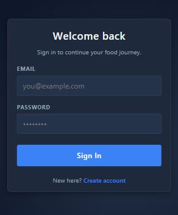
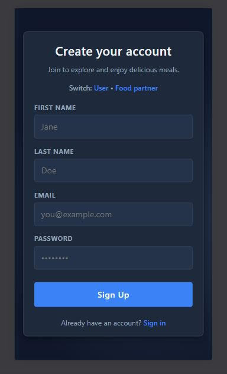
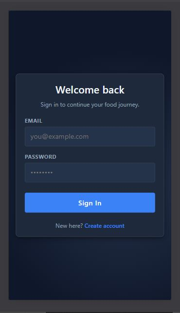
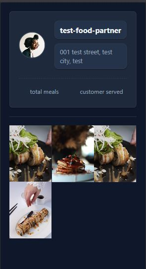

# Reel Food Delivery App

A modern food delivery concept connecting food lovers with local food partners, featuring food video in reels style and order food through it and a seamless user experience.

## Screenshots

### User Facing
- **Home Page**  
    
- **User Login**  
    
- **User Registration**  
    


### Food Partner Facing
- **Partner Login**  
    
- **Partner Registration**  
    
- **Create Food**   
    
- **Food partner profile**  
    

## Features

- User authentication (register/login/logout)
- Food partner dashboard
- Save favorite food items
- Mobile-responsive design
- Like and comment functionality

## Tech Stack

- **Frontend**: React.js, React Router, CSS
- **Backend**: Node.js, Express.js
- **Database**: MongoDB
- **Authentication**: JWT
- **Storage**: ImageKit for image/video hosting

## Getting Started

### Prerequisites
- Node.js (v16+)
- MongoDB
- npm or yarn

### Installation

1. Clone the repository
2. Install dependencies:
   ```bash
   # Install backend dependencies
   cd backend
   npm install
   
   # Install frontend dependencies
   cd ../frontend
   npm install
   ```

3. Set up environment variables (create .env files in both frontend and backend)

4. Start the development servers:
   ```bash
   # Start backend
   cd backend
   npm run dev
   
   # In a new terminal
   cd frontend
   npm run dev
   ```

## Environment Variables

### Backend (.env)
```
MONGODB_URI=your_mongodb_connection_string
JWT_SECRET=your_jwt_secret
IMAGEKIT_PUBLIC_KEY=your_imagekit_public_key
IMAGEKIT_PRIVATE_KEY=your_imagekit_private_key
IMAGEKIT_URL_ENDPOINT=your_imagekit_url_endpoint
```

## Project Structure

```
Reel-Food-Delivery-app/
├── backend/           # Backend server code
│   ├── src/
│   │   ├── controllers/
│   │   ├── models/
│   │   ├── routes/
│   │   └── middlewares/
│   └── server.js
├── frontend/          # Frontend React app
│   ├── public/
│   └── src/
│       ├── components/
│       ├── pages/
│       ├── routes/
│       └── styles/
└── screenshots/       # Screenshots for documentation
```

## Note for Recruiters

This project demonstrates my full-stack development skills with the MERN stack. Key highlights:
- Implemented secure authentication with JWT
- Built responsive UIs with React and TailwindCSS
- Integrated third-party services (ImageKit)
- Followed RESTful API design principles
- Wrote clean, maintainable code with proper error handling

The application is designed to be scalable and maintainable, with a clear separation of concerns between the frontend and backend.

## Contributing

Contributions are welcome! Please feel free to submit a Pull Request.

